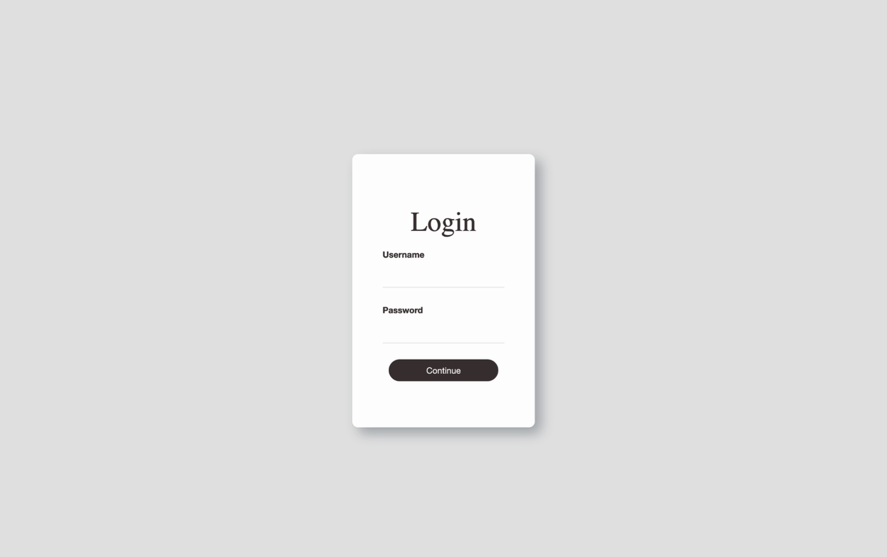
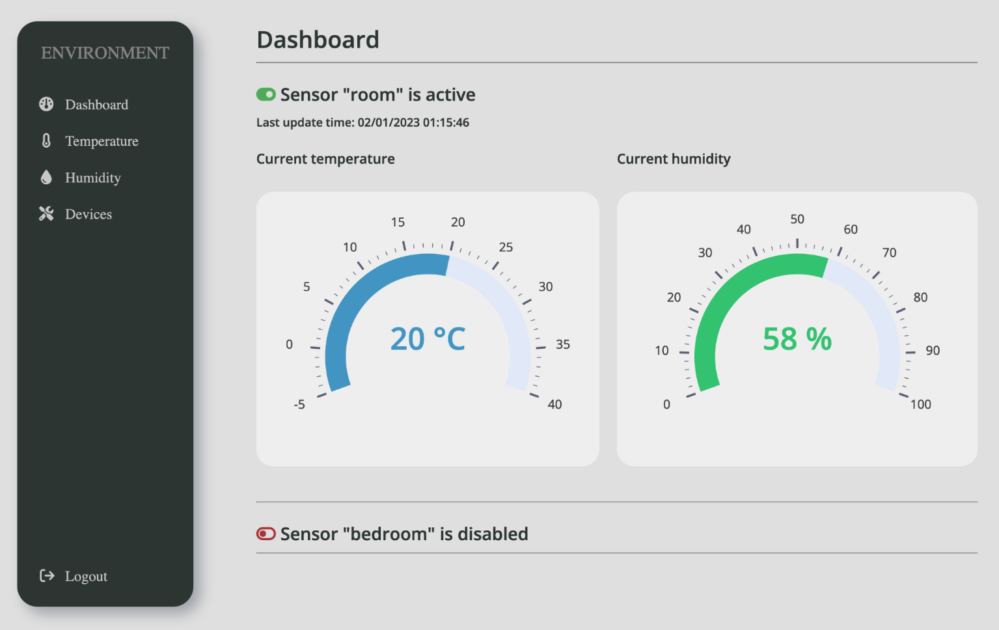
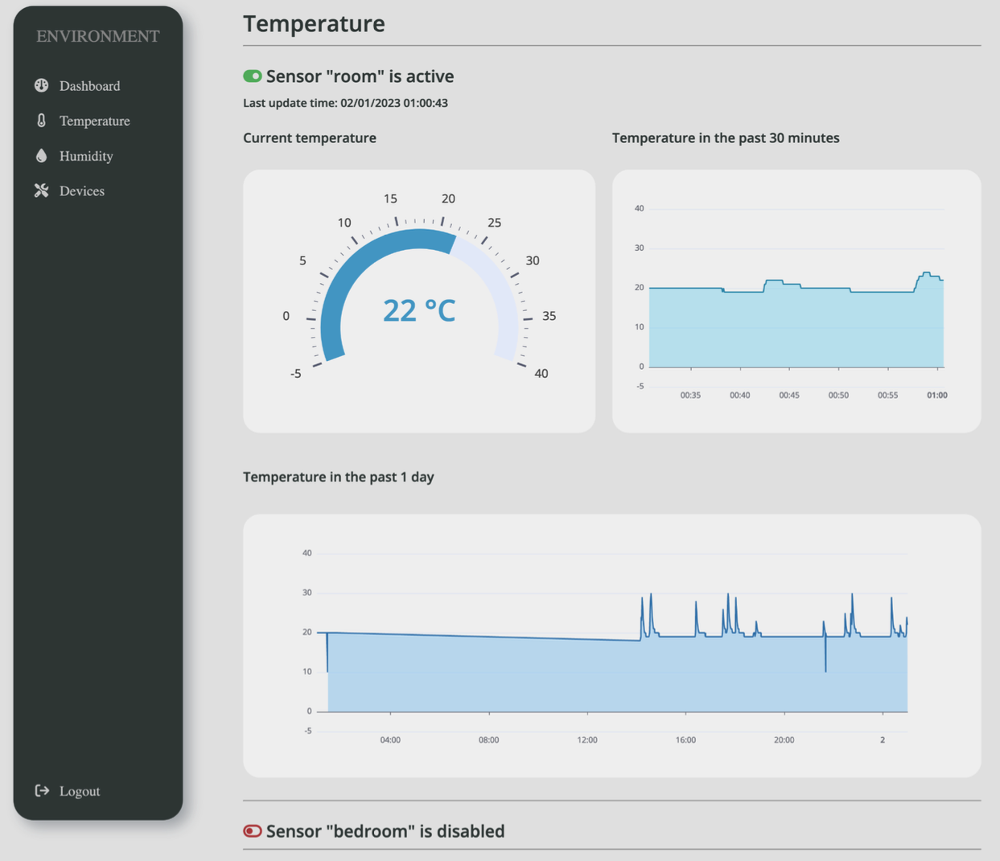
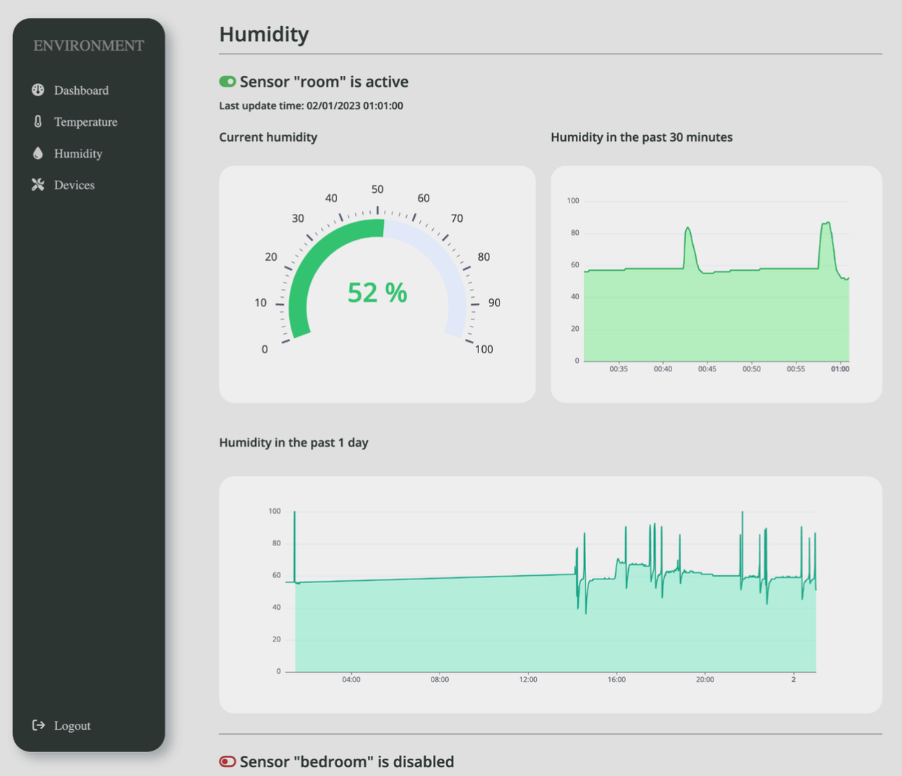
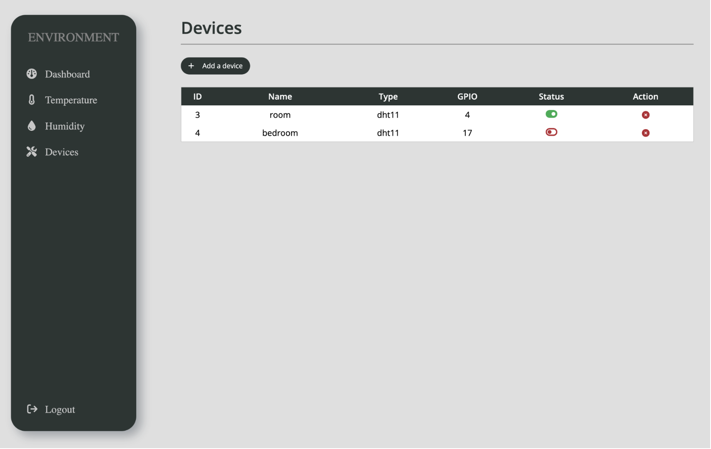
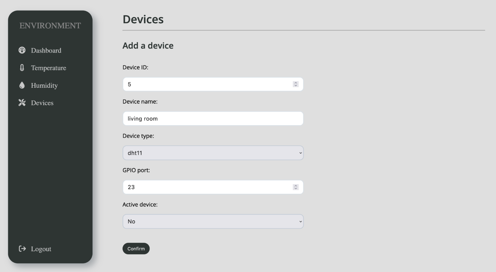

# Environmental monitoring platform based on Raspberry Pi and Django

## Tech stack

- 🍓Raspberry Pi

- 💦DHT11
- 🦟MQTT
- 🐍Python
- 🛠️Django
- ⚡️JavaScript
- 🚗Echarts
- ☁️AWS (IoT Core, Lambda, RDS, VPC, EC2)
- 🧘Restful API
- 🥋Nginx
- ⚙️wsgi

## Introduction

We developed this platform using Raspberry Pi and DHT11 to complete the detection of temperature and humidity in the environment. We used the MQTT protocol to send the data to the AWS IoT client. We created AWS Lambda expressions and passed the data to AWS RDS (PostgreSQL) for data storage. A Django web application deployed on AWS EC2 relying on Nginx and wsgi reads the data from the database and visualizes it using Echarts. Also, we implemented a Restful API to control the sensors connected to the Raspberry Pi and integrated the functionality in the web application.

This project contains two parts:

Django web application part: https://github.com/Szzx123/PlatformIoT-Environment-RaspberryPi-Django-AWS-Web

Monitoring data and API listening to sensor status in Raspberry Pi part: https://github.com/Szzx123/PlatformIoT-Environment-RaspberryPi

### Web Application Overview

Login Page

Main Page

Temperature Dashboard

Humidity Dashboard

Devices Control

