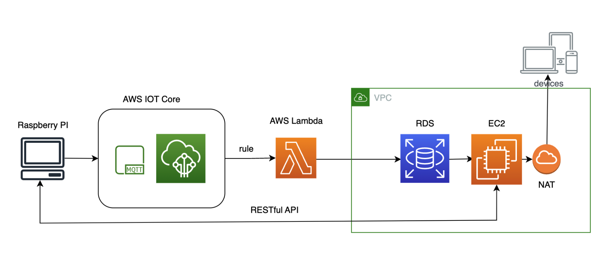
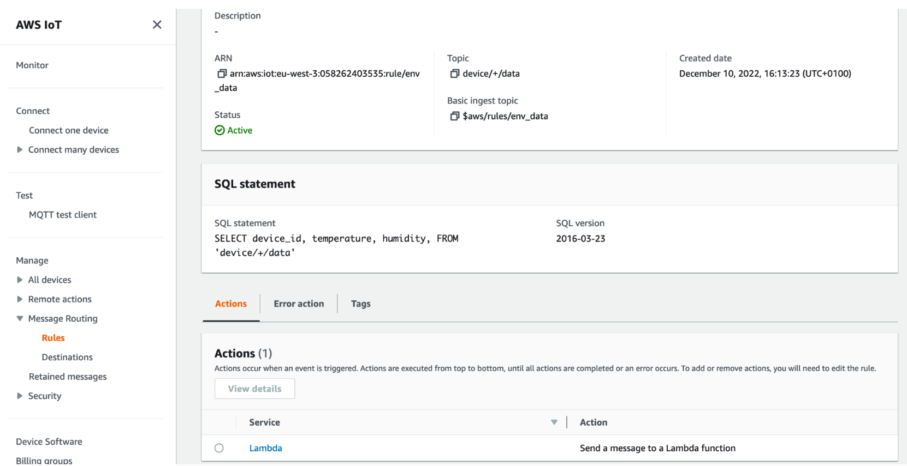
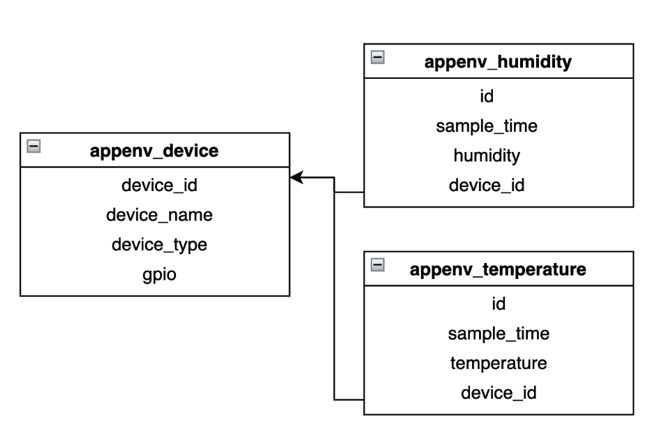
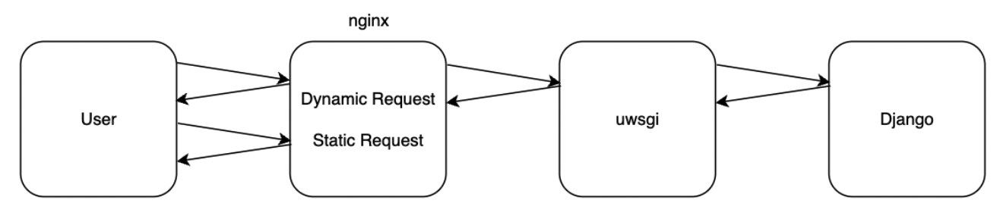

# Environmental monitoring platform based on Raspberry Pi and Django

## Tech stack

- 🍓Raspberry Pi

- 💦DHT11
- 🦟MQTT
- 🐍Python
- 🛠️Django
- ⚡️JavaScript
- 🚗Echarts
- ☁️AWS (IoT Core, Lambda, RDS, VPC, EC2)
- 🧘Restful API
- 🥋Nginx
- ⚙️wsgi

## Introduction

We developed this platform using Raspberry Pi and DHT11 to complete the detection of temperature and humidity in the environment. We used the MQTT protocol to send the data to the AWS IoT client. We created AWS Lambda expressions and passed the data to AWS RDS (PostgreSQL) for data storage. A Django web application deployed on AWS EC2 relying on Nginx and wsgi reads the data from the database and visualizes it using Echarts. Also, we implemented the Restful API to control the sensors connected to the Raspberry Pi and integrated the functionality in the web application.

This project contains two parts:

Django web application part: https://github.com/Szzx123/PlatformIoT-Environment-RaspberryPi-Django-AWS-Web

Monitoring data and API listening to sensor status in Raspberry Pi part: https://github.com/Szzx123/PlatformIoT-Environment-RaspberryPi

### Web Application Overview

Login Page


Main Page


Temperature Dashboard


Humidity Dashboard


Devices Control


### Structure



The diagram above shows the structure of our project. First, on the Raspberry Pi side, it collects data from the DHT11 connected to it, and then transmits it via the MQTT protocol to the IOT Core MQTT client in the AWS cloud service.

We then created a rule in the AWS IOT so that whenever it receives data, it triggers AWS Lambda, using Lambda to transmit the data into the AWS RDS database in the VPC we created.

In order to provide an interactive interface for sensor management and visualization, we developed a web application using Django and Python, which was deployed on an AWS EC2 instance by nginx + uwsgi and read the data stored in the RDS.

With the NAT configured by the VPC, we can access this web application from the public network. Finally, to implement functions related to control, adding sensors, etc., we created RESTful APIs in Django for the Raspberry Pi to access and execute commands.

## Getting started

### Setting up Raspberry Pi and AWS IoT

You can refer to the following tutorial for configuration: https://docs.aws.amazon.com/iot/latest/developerguide/connecting-to-existing-device.html

After you have configured the environment on the Raspberry Pi side, you can use our code to send data to the IoT Core.

In your Raspberry Pi terminal:

```bash
git pull https://github.com/Szzx123/PlatformIoT-Environment-RaspberryPi.git
cd PlatformIoT-Environment-RaspberryPi
python3 AWS_DHT_RPI.py
--topic device/3/data --ca_file ~/Desktop/mqtt/AmazonRootCA1.pem
--cert ~/Desktop/mqtt/certificate.pem.crt
--key ~/Desktop/mqtt/private.pem.key
--endpoint a3vf4f15xaiiy7-ats.iot.eu-west-3.amazonaws.com
--device_id 3 --gpio 4 --count 10000
```

`--topic` is an event that we and AWS IOT need to subscribe to together and AWS IOT rules can receive data under the same event and operate it.

The `--ca_file`, `--cert`, `--key` parameters are the provided certificates and keys we need to use our own AWS cloud service, which ensures security. And --count represents the number of times we want to read the data.

`--device_id` is the number you want to set for the DHT11, it can be any number. `--gpio` is the gpio number of your DHT11 connected to the Raspberry Pi. `--count` is the number of times to send data to IoT Core.

### Setting up IoT Rules, Lambda and RDS

 The next thing we need to do is to enable Lambda to listen to the data we send to the MQTT client via IoT Rules.

https://docs.aws.amazon.com/iot/latest/developerguide/iot-rules.html

We need to create a common name topic and set up the SQL statement to extract the data from Json with the following configuration:



After that we use the RDS service to create a PostgreSQL database.

https://aws.amazon.com/rds/?nc1=h_ls

To adapt our web application, the UML diagram of the database therein is as follows:



You can also use the orm framework in our Django application to generate the database directly, which will be mentioned later.

The next thing to do is to create a Lambda expression to make an association with the IoT's RULE so that the IoT Rule becomes its trigger.

```python
import json
import psycopg2
from datetime import datetime
def lambda_handler(event, context):
print(event)
print(context)
# Connect to the AWS PostgreSQL database
conn = psycopg2.connect(
host='10.0.5.28',
port=5432,
database='sr08',
user='postgres',
password='xxxxxxxx'
)
# Create a cursor
cur = conn.cursor()
sample_time = datetime.now()
cur.execute("INSERT INTO appenv_temperature (temperature,
sample_time, device_id) VALUES (%s, %s, %s)",
            (event['temperature'], sample_time, event['device_id']))
      cur.execute("INSERT INTO appenv_humidity (humidity, sample_time,
device_id) VALUES (%s, %s, %s)",
            (event['humidity'], sample_time, event['device_id']))
      cur.close()
      conn.commit()
      conn.close()
```

This is the code in the Lambda expression. We use python and psycopg2 to read and write to the RDS. `host` is the private address of your RDS. `database` is the name of your database.

### Deploying Django web applications on EC2

You need to create a good VPC and create your own EC2 server to connect to the RDS.

https://aws.amazon.com/pm/ec2/?trk=ff33597c-eaca-4d2b-b510-09e68c4d82d1&sc_channel=ps&s_kwcid=AL!4422!3!496473794115!e!!g!!aws%20ec2&ef_id=CjwKCAjw5dqgBhBNEiwA7PryaI52dgna_c9tgaB3soLb7dL0Eij7Cu2zjOLgczE_j2rHYtKNVr5v3xoCplUQAvD_BwE:G:s&s_kwcid=AL!4422!3!496473794115!e!!g!!aws%20ec2

We use Nginx and wsgi for deployment, as a proxy for web application traffic.



wsgi is a simple calling convention allowing web servers to pass requests to web applications or frameworks written in the Python programming language.

The goal of our deployment approach is to optimize the performance of the web application. As shown in the diagram above, user requests will be divided into two categories. When the user request is a dynamic request, it will be passed by nginx to wsgi and then to Django for processing. When the request is for a static resource, nginx will return the preloaded static resource directly to the user.

Start by cloning the code for the Django web application.

```bash
git clone https://github.com/Szzx123/PlatformIoT-Environment-RaspberryPi-Django-AWS-Web.git
```

Use Django's orm framework for database migration.

```shell
cd PlatformIoT-Environment-RaspberryPi-Django-AWS-Web
python manage.py makemigrations appenv
python manage.py migrate appenv
```

Install wsgi:

```bash
pip install uwsgi
```

Create the file `uwsgi.ini` in the project directory. This is the configuration file for the wigi commands.

```bash
cd PlatformIoT-Environment-RaspberryPi-Django-AWS-Web
nano uwsgi.ini
```

Put the following code in the file:

```shell
[uwsgi]
http = :9090
chdir = /home/ubuntu/PlatformIoT-Environment-RaspberryPi-Django-AWS-Web
module = Projet.wsgi:application
processes = 4
threads = 2
stats = 127.0.0.1:9191
static-map=/static/=/home/ubuntu/PlatformIoT-Environment-RaspberryPi-Django-AWS-Web/static
```

Start wsgi:

```bash
uwsgi --ini uwsgi.ini
```

This way our web application is already accessible using EC2's public IP.

Next, you need to configure Nginx.

```bash
apt-get install nginx
```

Under the path `/etc/nginx/sites-enabled`, create a new `nginx.conf` file.

```shell
# the upstream component nginx needs to connect to
upstream django {
      # server unix:///path/to/your/mysite/mysite.sock; # for a file socket
			server 127.0.0.1:9090; 
}
# configuration of the server
server {
      # the port your site will be served on
      listen 8000;
			# the domain name it will serve for
			server_name 13.38.217.255; # substitute your machine's IP address or FQDN
			charset utf-8;
			# max upload size
			client_max_body_size 75M; # adjust to taste
			location /static {
			alias /home/ubuntu/sr08/static; # your Django project's static
			files - amend as required
			}
 			 # Finally, send all non-media requests to the Django server.
			location / {
			uwsgi_pass django;
			include /home/ubuntu/sr08/uwsgi_params; # the uwsgi_params file you installed
			} 
}
```

For this to work, we need to create a connection for it with `/etc/nginx/sites-enabled/`.

```bash
sudo ln -s /etc/nginx/sites-available/mysite_nginx.conf /etc/nginx/sites-enabled/
```

Note that the `uwsgi_params` configuration file is now missing from the project. So we have to copy the configuration file provided with Nginx into the directory where `manage.py` is located in our own Django project.

```shell
cp /etc/nginx/uwsgi_params ~/PlatformIoT-Environment-RaspberryPi-Django-AWS-Web/
```

Finally, restart Nginx.

```shell
systemctl restart nginx
```

At this point, the entire project has been deployed.

Finally, in order to implement the functions associated with controlling the sensors, we need to use the API to interact with the Raspberry Pi. In the program file on the Raspberry Pi side that we just cloned down, sc.py is the script we created to listen to the platform operations.

```shell
cd PlatformIoT-Environment-RaspberryPi
python3 sc.py
```

